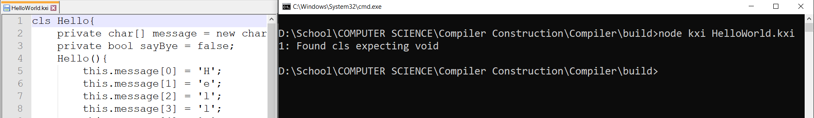
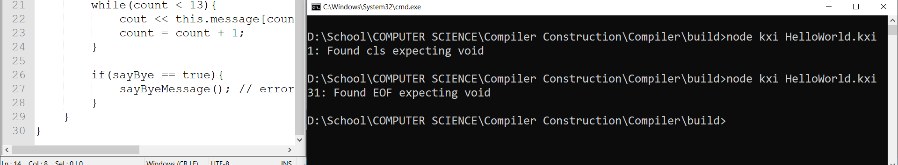
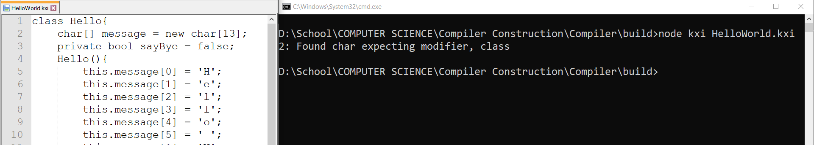

# Compiler-Dummy-Repo
Dummy repository to describe the actual private Compiler repo

Since the Compiler I wrote is a Senior Capstone Project at Utah Valley University, I decided to describe the project here in order to not show the code publicly.

The Compiler is for a language named KXI which is based on C++ and Java. It supports functional programming, objects and arrays. There are 5 stages that are part of the Compiler which include:

## Lexical Analysis
Read a file line by line and tokenize the input. I created an API which uses functions to get current, next and 2nd token including a function to read the next line.

## Syntax Analysis
As each line is read in the kxi file, make sure the code follows the grammar provided by the language. If an error is found, the Compiler stops running and displays the line number and a specific error message to the user. A symbol table gets created with token information that is used for the next phase. Once the entire file is read and no errors are found, the Compiler will do a second pass read.

Note: Switch statements are included in the grammar for error checking but they stop at this phase which means they won't get executed since there is no assembly written for them.

### Syntax Analysis Examples:

Class keyword is mispelled so program searches for next required thing in the grammar which is void kxi2020 main()

Main is missing

Modifier is missing

## Semantic Analysis
As each line is read in the kxi file during the second pass, Compiler checks for type checking, flow of control, uninitialized variables, duplicate names for variables, arrays, objects, etc. If errors are found, the Compiler stops and outputs to the console the line number the error was found and a specific message.

## Intermediate Code Generation
To help make the final phase easier, a quad table is created with intermediate assembly code. The quad table helps with creating labels for assembly branch statements which are used for while loops and if statements.

## Target Code Generation
The final phase is where the assembly code is written based on the quad table of the previous phase. This assembly code is then read the Virtual Machine I created that executes assembly.
